# LearnHub LMS — Architecture Documentation

> **Generated:** 2026-05-31
> **Framework:** Next.js 16.2.1 · **CMS:** Payload CMS · **Database:** PostgreSQL (via `@payloadcms/db-postgres`) · **Language:** TypeScript 5.7.3

---

## Table of Contents

1. [System Overview](#system-overview)
2. [Request Flow](#request-flow)
3. [Directory-by-Directory Breakdown](#directory-by-directory-breakdown)
4. [Module Dependency Graph](#module-dependency-graph)
5. [Collection Schemas](#collection-schemas)
6. [Authentication & Authorization](#authentication--authorization)
7. [Exported Functions (JSDoc)](#exported-functions-jsdoc)

---

## System Overview

LearnHub LMS is a learning management system built on **Next.js** (App Router) with **Payload CMS** as its headless CMS and data layer. The application has two distinct mounting points:

| Mount | Purpose | Location |
|---|---|---|
| `/app/(frontend)/` | Student-facing UI (React pages) | `src/app/(frontend)/` |
| `/app/(payload)/` | Payload Admin UI + API | `src/app/(payload)/` |
| `/api/*` | Custom REST API routes (Next.js Route Handlers) | `src/app/api/` |
| `/api/auth/*` | Legacy auth API routes | `src/api/auth/` |

**Database:** PostgreSQL via `@payloadcms/db-postgres` (configured in `payload.config.ts`). All Payload collections map to Postgres tables.

**Authentication:** Dual auth systems co-exist:
- `AuthService` + `JwtService` + `SessionStore` — primary, PBKDF2 password hashing, JWT access/refresh tokens, HTTP-only cookie sessions
- `UserStore` — legacy in-memory store (SHA-256, no JWT), used by some API routes

**Role Model:** RBAC with three tiers (`admin` > `editor` > `viewer`), enforced by `withAuth` HOC and `ROLE_HIERARCHY`.

---

## Request Flow

### Typical API Request (Next.js Route Handler)

```
HTTP Request
    │
    ▼
src/app/api/<resource>/route.ts      (Next.js Route Handler)
    │  - Validates input (withAuth HOC, sanitizers)
    ▼
src/auth/withAuth.ts                 (HOC — extracts Bearer token, verifies JWT)
    │  - extractBearerToken() → JwtService.verify()
    │  - checkRole() → verifies RBAC
    ▼
src/services/*.ts                    (Business logic layer)
    │  - GradebookService, ProgressService, NotificationService,
    │    CourseSearchService, QuizGrader, etc.
    ▼
src/collections/*.ts                  (Payload Collection Configs — DB schema + access control)
    │
    ▼
PostgreSQL via @payloadcms/db-postgres
```

### Payload Admin Request

```
HTTP Request
    │
    ▼
src/app/(payload)/admin/[[...segments]]/page.tsx   (Payload Admin UI)
    │
    ▼
src/payload.config.ts                  (Payload buildConfig — imports all collections)
    │
    ▼
src/collections/*.ts                    (Collection schemas)
    │
    ▼
PostgreSQL via @payloadcms/db-postgres
```

### Frontend Page Request

```
HTTP Request
    │
    ▼
src/app/(frontend)/<route>/page.tsx    (Next.js React Server/Client Component)
    │  - Server Component: fetches data via Payload Local API
    │  - Client Component: uses useAuth(), usePayload() hooks
    ▼
src/auth/withAuth.ts                    (withAuth HOC for protected pages)
    ▼
src/services/*.ts                      (Business logic)
    ▼
Payload Collections → PostgreSQL
```

---

## Directory-by-Directory Breakdown

### `src/app/` — Next.js App Router

#### `src/app/(frontend)/` — Student/Instructor UI Pages

| File | Responsibility |
|---|---|
| `page.tsx` | Landing page |
| `layout.tsx` | Root layout for frontend (providers, global styles) |
| `dashboard/page.tsx` | Student dashboard with enrolled courses, progress |
| `notes/page.tsx` | Notes listing page |
| `notes/[id]/page.tsx` | Single note view |
| `notes/create/page.tsx` | Note creation page |
| `notes/edit/[id]/page.tsx` | Note editing page |
| `instructor/courses/[id]/edit/page.tsx` | Course editor (instructor-facing) |
| `styles.css` | Frontend-specific CSS |

#### `src/app/(payload)/` — Payload Admin Mount

| File | Responsibility |
|---|---|
| `admin/[[...segments]]/page.tsx` | Payload admin catch-all route |
| `admin/[[...segments]]/not-found.tsx` | 404 for admin routes |
| `admin/importMap.js` | Auto-generated Payload component import map |
| `api/graphql/route.ts` | Payload GraphQL endpoint |
| `api/graphql-playground/route.ts` | GraphQL playground UI |
| `api/[...slug]/route.ts` | Payload REST API catch-all |
| `layout.tsx` | Payload admin layout wrapper |
| `custom.scss` | Payload admin custom styles |

#### `src/app/api/` — Custom REST API Routes (Next.js Route Handlers)

| Route | File | Responsibility |
|---|---|---|
| `GET /api/health` | `health/route.ts` | Health check (uptime, timestamp) |
| `GET/POST /api/notes` | `notes/route.ts` | List/search notes (public), create note (admin/editor) |
| `GET/PUT/DELETE /api/notes/:id` | `notes/[id]/route.ts` | Get/update/delete individual note |
| `POST /api/enroll` | `enroll/route.ts` | Enroll viewer-role user in a course |
| `GET /api/gradebook` | `gradebook/route.ts` | Student gradebook |
| `GET /api/gradebook/course/:id` | `gradebook/course/[id]/route.ts` | Course gradebook (editor/admin) |
| `GET /api/courses/search` | `courses/search/route.ts` | Course search with filters |
| `GET /api/quizzes/:id` | `quizzes/[id]/route.ts` | Get quiz |
| `POST /api/quizzes/:id/submit` | `quizzes/[id]/submit/route.ts` | Submit quiz answers for grading |
| `GET /api/quizzes/:id/attempts` | `quizzes/[id]/attempts/route.ts` | Get user's quiz attempts |
| `GET /api/notifications` | `notifications/route.ts` | Get unread notifications |
| `POST /api/notifications/read-all` | `notifications/read-all/route.ts` | Mark all notifications read |
| `GET/PATCH /api/notifications/:id/read` | `notifications/[id]/read/route.ts` | Mark notification read |
| `GET /api/dashboard/admin-stats` | `dashboard/admin-stats/route.ts` | Admin-only user statistics |
| `GET /api/csrf-token` | `csrf-token/route.ts` | CSRF token endpoint |
| `*` | `my-route/route.ts` | Test/custom route |

---

### `src/api/auth/` — Legacy Auth API Routes

| File | Responsibility |
|---|---|
| `login.ts` | POST login (UserStore-based, not Payload) |
| `logout.ts` | POST logout (clears session) |
| `register.ts` | POST register new user |
| `profile.ts` | GET/PUT authenticated user profile |
| `refresh.ts` | POST refresh access token |
| `*.test.ts` | Co-located Vitest unit tests |

**Note:** These routes use the legacy `UserStore` + `SessionStore` system (SHA-256 passwords, no Payload auth). New routes should use `AuthService` + `JwtService` (PBKDF2, JWT).

---

### `src/auth/` — Authentication & Session Management

| File | Responsibility |
|---|---|
| `auth-service.ts` | `AuthService` class — PBKDF2 password verification, JWT token generation/verification, login/refresh/logout |
| `jwt-service.ts` | `JwtService` class — HMAC-SHA256 JWT signing/verification, token blacklist, access/refresh token factory methods |
| `session-store.ts` | `SessionStore` class — in-memory session store, per-user session limit (5), token index |
| `user-store.ts` | `UserStore` class — legacy in-memory user store with SHA-256 hashing, lockout logic |
| `withAuth.ts` | `withAuth()` HOC — wraps Next.js route handlers with JWT auth + RBAC |
| `_auth.ts` | `extractBearerToken()`, `checkRole()`, `ROLE_HIERARCHY` |
| `index.ts` | Barrel re-export |
| `*.test.ts` | Co-located tests |

---

### `src/collections/` — Payload CMS Collection Configurations

Each file exports a `CollectionConfig` object (used in `payload.config.ts`) AND often an in-memory store class for non-Payload use cases.

| Collection | File | Notes |
|---|---|---|
| `users` | `Users.ts` | Auth-enabled, roles: admin/editor/viewer |
| `courses` | `Courses.ts` | title, slug (auto), richText description, instructor, status, difficulty, weights |
| `modules` | `Modules.ts` | ModuleStore (in-memory) + Payload collection |
| `lessons` | `Lessons.ts` | LessonStore (in-memory) + Payload collection; types: video/text/interactive |
| `enrollments` | `Enrollments.ts` | student↔course relationship, status: active/completed/dropped |
| `assignments` | `Assignments.ts` | RichText instructions, rubric, due date, maxScore |
| `submissions` | `Submissions.ts` | Student submission with attachments, grade, feedback |
| `quizzes` | `Quizzes.ts` | Questions array (multiple-choice/true-false/short-answer) |
| `quiz-attempts` | `QuizAttempts.ts` | Tracks per-user quiz submissions and scores |
| `media` | `Media.ts` | File upload collection (Payload built-in upload) |
| `certificates` | `certificates.ts` | CertificatesStore (in-memory) + Payload collection |
| `notifications` | `Notifications.ts` | Per-user notification with type, read status |
| `notes` | `notes.ts` | NotesStore (API-backed) + Payload collection |
| `contacts` | `contacts.ts` | ContactStore (in-memory) + query/pagination/search |
| `discussions` | `Discussions.ts` | DiscussionsStore (in-memory), nested replies |
| `tasks` | `tasks.ts` | TaskStore (in-memory), Kanban board (todo/in-progress/done) |
| `enrollments-store` | `EnrollmentStore.ts` | Mock enrollment store (note: `Enrollments` collection is the real DB store) |
| `notifications-store` | `NotificationsStore.ts` | In-memory notification preferences + quiet hours |

---

### `src/services/` — Business Logic Layer

| File | Responsibility |
|---|---|
| `progress.ts` | `ProgressService` — lesson completion tracking, enrollment completion |
| `gradebook.ts` | `GradebookService<T>` — generic gradebook with quiz/assignment weighting |
| `gradebook-payload.ts` | `PayloadGradebookService` — wires `GradebookService` to Payload collections |
| `quiz-grader.ts` | `gradeQuiz()` — question grading engine, attempt counting |
| `grading.ts` | `GradingService` — assignment grading workflow |
| `notifications.ts` | `NotificationService` — CRUD for Payload `notifications` collection |
| `course-search.ts` | `CourseSearchService` — full-text + filter/sort/paginate courses |
| `discussions.ts` | `DiscussionService` — thread building, reply depth limits, pin/resolve |
| `certificates.test.ts` | Tests for certificate issuance logic |
| `grading.test.ts` | Tests for grading service |
| `quiz-grader.test.ts` | Tests for quiz grading |
| `notifications.test.ts` | Tests for notification service |
| `course-search.test.ts` | Tests for course search |
| `discussions.test.ts` | Tests for discussion service |
| `gradebook.test.ts` | Tests for gradebook service |

---

### `src/security/` — Security Utilities

| File | Responsibility |
|---|---|
| `csrf-token.ts` | `CsrfTokenService` — single-use CSRF tokens with rotation, TTL, cleanup |
| `sanitizers.ts` | `sanitizeHtml()`, `sanitizeSql()`, `sanitizeUrl()`, `sanitizeFilePath()`, `sanitizeObject()` |
| `validation-middleware.ts` | `createValidationMiddleware()` — schema-validated request parsing |
| `csrf-token.test.ts` | Tests for CSRF token service |
| `sanitizers.test.ts` | Tests for sanitizers |
| `validation-middleware.test.ts` | Tests for validation middleware |

---

### `src/middleware/` — Next.js Middleware

| File | Responsibility |
|---|---|
| `request-logger.ts` | `createRequestLogger()` — HTTP request/response logging, JSON/text format, level filtering |
| `rate-limiter.ts` | `SlidingWindowRateLimiter` + `createRateLimiterMiddleware()` — per-IP or per-API-key sliding window |
| `auth-middleware.ts` | `createAuthMiddleware()` — legacy UserStore+SessionStore JWT auth (not used by new routes) |
| `role-guard.ts` | `requireRole()` — HOC that checks role hierarchy |
| `validation.ts` | `createValidationMiddleware()` — schema-based body/query/params validation |
| `csrf-middleware.ts` | `createCsrfMiddleware()` — CSRF protection for non-safe HTTP methods |
| `*.test.ts` | Co-located tests |

---

### `src/utils/` — General Purpose Utilities

| File | Responsibility |
|---|---|
| `di-container.ts` | `Container` + `ChildContainer` — type-safe DI with singleton/transient lifecycles, circular dep detection |
| `result.ts` | `Result<T,E>` — `Ok`/`Err` discriminated union, `tryCatch()`, `fromPromise()` |
| `cache.ts` | In-memory cache with TTL and LRU eviction |
| `event-bus.ts` | `EventBus` — publish/subscribe with wildcard support |
| `event-emitter.ts` | Node.js-compatible `EventEmitter` |
| `message-bus.ts` | Message bus pattern |
| `retry-queue.ts` | `RetryQueue` — async task queue with retry and backoff |
| `retry.ts` | `retry()` — generic retry with configurable attempts/delay |
| `promise-pool.ts` | `PromisePool` — concurrency-limited promise executor |
| `queryBuilder.ts` | SQL-like query builder for filters |
| `schema.ts` | `Schema._validate()` pattern for runtime validation |
| `slugify.ts` | String slugification |
| `format-date.ts` | Date formatting |
| `format-currency.ts` | Currency formatting |
| `format-number.ts` | Number formatting |
| `helpers.ts` | Miscellaneous helpers |
| `group-by.ts` | `groupBy()` — array grouping utility |
| `chunk.ts` | `chunk()` — array splitting |
| `flatten.ts` | `flatten()` — nested array flattening |
| `compact.ts` | `compact()` — falsy value removal |
| `unique.ts` | `unique()` — deduplication |
| `sort`: `sorted-array.ts` | Sorted array data structure |
| `stack.ts` | Stack data structure |
| `queue.ts` | Queue data structure |
| `cap.ts` | `cap()` — value clamping |
| `clamp.ts` | `clamp()` — range clamping |
| `memoize.ts` | `memoize()` — function memoization |
| `debounce.ts` | `debounce()` — debounce function |
| `throttle.ts` | `throttle()` — throttle function |
| `omit.ts` | `omit()` — object key omission |
| `pick.ts` | `pick()` — object key selection |
| `deep-clone.ts` | Deep object cloning |
| `diff.ts` | Object diffing |
| `state-machine.ts` | `StateMachine` — state transition machine |
| `undo-redo.ts` | Undo/redo stack |
| `dep-graph.ts` | Dependency graph topological sort |
| `isbn-validator.ts` | ISBN validation |
| `color.ts` | Color manipulation utilities |
| `to-kebab-case.ts` | String case conversion |
| `capitalize-words.ts` | Word capitalization |
| `truncate.ts` | String truncation |
| `truncate-words.ts` | Word-boundary truncation |
| `repeat.ts` | String repetition |
| `reverse.ts` | Array reversal |
| `range.ts` | Numeric range generation |
| `sum.ts` | Numeric sum |
| `pad-start.ts` | String padding |
| `sleep.ts` | Async sleep utility |
| `pipe.ts` | Function composition pipe |
| `url-parser.ts` | URL parsing utilities |
| `notificationHelpers.ts` | Notification formatting helpers |
| `*.test.ts` | Co-located Vitest tests |

---

### `src/components/` — React Components

| Directory | Responsibility |
|---|---|
| `auth/` | `AuthForm`, `PasswordStrengthBar`, `ProtectedRoute`, `SessionCard` |
| `board/` | Kanban board components: `Column`, `TaskCard`, `TaskModal`, `AddTaskButton`, `PriorityBadge` |
| `command-palette/` | `CommandPalette` — keyboard-driven command UI |
| `contacts/` | `ContactTable`, `ContactAvatar`, `SearchBar`, `TagFilter`, `Pagination` |
| `course-editor/` | `ModuleList`, `LessonEditor`, `CoursePublishToggle` |
| `dashboard/` | `CourseProgressCard`, `ProgressRing`, `UpcomingDeadlines`, `RecentActivity` |
| `dark-mode-toggle/` | Theme toggle button |
| `error/` | `ErrorPage`, `NotFoundPage` |
| `notes/` | `NoteCard`, `NoteForm`, `SearchBar`, `TagBadge`, `ConfirmDialog` |
| `notifications/` | `Bell` (notification bell), `Toast` |
| `virtual-list/` | Virtualized list for large datasets |
| `error-boundary.tsx` | React error boundary |

---

### `src/hooks/` — React Custom Hooks

| File | Responsibility |
|---|---|
| `useCommandPalette.ts` | `'use client'` — command palette state management |
| `useCommandPaletteShortcut.ts` | Keyboard shortcut binding for command palette |
| `useCommandPalette.test.ts` | Tests |

---

### `src/contexts/` — React Context Providers

| File | Responsibility |
|---|---|
| `auth-context.tsx` | `'use client'` — auth state provider wrapping `useAuth()` |

---

### `src/pages/` — Legacy Pages (Pages Router)

| Directory | File | Responsibility |
|---|---|---|
| `auth/` | `login.tsx`, `register.tsx`, `profile.tsx` | Legacy auth pages |
| `board/` | `index.tsx` | Legacy Kanban board page |
| `contacts/` | `list/page.tsx`, `detail/page.tsx`, `form/page.tsx` | Legacy contact management |
| `notifications/` | `index.tsx` | Legacy notifications page |

---

### `src/routes/` — Express-style Route Handlers

| File | Responsibility |
|---|---|
| `notifications.ts` | `GET` unread notifications, `POST` mark all read |

---

### `src/migrations/` — Payload DB Migrations

| File | Responsibility |
|---|---|
| `index.ts` | Migration index |
| `20260322_233123_initial.ts` | Initial schema migration |
| `20260405_000000_add_users_permissions_lastLogin.ts` | Adds permissions and lastLogin fields |

---

### `src/models/` — Domain Type Models

| File | Responsibility |
|---|---|
| `notification.ts` | `Notification`, `NotificationFilter`, `NotificationSeverity` types |

---

## Module Dependency Graph

```mermaid
graph TB
    subgraph "Entry Points"
        NEXTJS["Next.js App Router\n(src/app/)"]
        API_ROUTES["API Route Handlers\n(src/app/api/, src/api/)"]
    end

    subgraph "Auth Layer"
        WITH_AUTH["withAuth HOC\n(src/auth/withAuth.ts)"]
        JWT_SVC["JwtService\n(src/auth/jwt-service.ts)"]
        AUTH_SVC["AuthService\n(src/auth/auth-service.ts)"]
        SESSION_STORE["SessionStore\n(src/auth/session-store.ts)"]
        USER_STORE["UserStore\n(src/auth/user-store.ts)\n⚠️ legacy"]
        EXTRACT["extractBearerToken\n(src/auth/_auth.ts)"]
        CHECK_ROLE["checkRole\n(src/auth/_auth.ts)"]
    end

    subgraph "Security"
        SANITIZERS["sanitizers.ts\n(src/security/)"]
        CSRF["CsrfTokenService\n(src/security/csrf-token.ts)"]
        VALIDATION_MW["Validation Middleware\n(src/middleware/validation.ts)"]
        RATE_LIMITER["SlidingWindowRateLimiter\n(src/middleware/rate-limiter.ts)"]
        REQUEST_LOGGER["RequestLogger\n(src/middleware/request-logger.ts)"]
    end

    subgraph "Business Logic (Services)"
        GRADEBOOK["GradebookService\n(src/services/gradebook.ts)"]
        PROGRESS["ProgressService\n(src/services/progress.ts)"]
        QUIZ_GRADER["QuizGrader\n(src/services/quiz-grader.ts)"]
        COURSE_SEARCH["CourseSearchService\n(src/services/course-search.ts)"]
        NOTIFICATION_SVC["NotificationService\n(src/services/notifications.ts)"]
        DISCUSSION_SVC["DiscussionService\n(src/services/discussions.ts)"]
        GRADEBOOK_PAYLOAD["PayloadGradebookService\n(src/services/gradebook-payload.ts)"]
    end

    subgraph "Data Layer"
        COLLECTIONS["Payload Collections\n(src/collections/)"]
        PAYLOAD_CONFIG["payload.config.ts"]
        DB["PostgreSQL\n@payloadcms/db-postgres"]
    end

    subgraph "Stores (In-Memory)"
        NOTES_STORE["NotesStore\n(src/collections/notes.ts)"]
        CONTACT_STORE["ContactStore\n(src/collections/contacts.ts)"]
        CERT_STORE["CertificatesStore\n(src/collections/certificates.ts)"]
        DISC_STORE["DiscussionsStore\n(src/collections/Discussions.ts)"]
        TASK_STORE["TaskStore\n(src/collections/tasks.ts)"]
        NOTIF_STORE["NotificationsStore\n(src/collections/NotificationsStore.ts)"]
        LESSON_STORE["LessonStore\n(src/collections/Lessons.ts)"]
        MODULE_STORE["ModuleStore\n(src/collections/Modules.ts)"]
        ENROLL_STORE["EnrollmentStore\n(src/collections/EnrollmentStore.ts)"]
    end

    subgraph "Utilities"
        DI["Container\n(src/utils/di-container.ts)"]
        RESULT["Result<T,E>\n(src/utils/result.ts)"]
        CACHE["Cache\n(src/utils/cache.ts)"]
        EVENT_BUS["EventBus\n(src/utils/event-bus.ts)"]
        RETRY["RetryQueue\n(src/utils/retry-queue.ts)"]
    end

    subgraph "UI Layer"
        COMPONENTS["React Components\n(src/components/)"]
        HOOKS["Custom Hooks\n(src/hooks/)"]
        CONTEXTS["Auth Context\n(src/contexts/auth-context.tsx)"]
    end

    %% Entry → Auth
    NEXTJS --> WITH_AUTH
    API_ROUTES --> WITH_AUTH

    %% Auth internal
    WITH_AUTH --> EXTRACT
    WITH_AUTH --> CHECK_ROLE
    EXTRACT --> JWT_SVC
    CHECK_ROLE --> JWT_SVC
    JWT_SVC --> AUTH_SVC
    AUTH_SVC --> SESSION_STORE
    AUTH_SVC --> JWT_SVC

    %% API Routes → Services
    API_ROUTES --> GRADEBOOK
    API_ROUTES --> PROGRESS
    API_ROUTES --> QUIZ_GRADER
    API_ROUTES --> COURSE_SEARCH
    API_ROUTES --> NOTIFICATION_SVC

    %% Services → Collections
    GRADEBOOK --> COLLECTIONS
    PROGRESS --> COLLECTIONS
    QUIZ_GRADER --> COLLECTIONS
    COURSE_SEARCH --> COLLECTIONS
    NOTIFICATION_SVC --> COLLECTIONS
    DISCUSSION_SVC --> DISC_STORE
    GRADEBOOK --> GRADEBOOK_PAYLOAD
    GRADEBOOK_PAYLOAD --> COLLECTIONS

    %% Collections → Payload Config → DB
    COLLECTIONS --> PAYLOAD_CONFIG
    PAYLOAD_CONFIG --> DB

    %% Stores are accessed directly by routes
    API_ROUTES --> NOTES_STORE
    API_ROUTES --> CERT_STORE

    %% Utils used everywhere
    GRADEBOOK --> DI
    DI --> RESULT
    RETRY --> CACHE

    %% Security used by routes
    API_ROUTES --> SANITIZERS
    API_ROUTES --> CSRF
    API_ROUTES --> RATE_LIMITER
    API_ROUTES --> VALIDATION_MW
    API_ROUTES --> REQUEST_LOGGER

    %% UI
    HOOKS --> CONTEXTS
    CONTEXTS --> WITH_AUTH
    COMPONENTS --> HOOKS
```



---

## Collection Schemas

### Users (`users`)
- **Slug:** `users` (auth-enabled)
- **Fields:** email (auth-provided), firstName, lastName, displayName (computed), avatar (media rel), bio, role (admin/editor/viewer), organization, refreshToken, tokenExpiresAt, lastTokenUsedAt, lastLogin, permissions
- **Auth:** `auth: true` (Payload built-in auth with email/password)
- **Access:** read (authenticated), create (public), update (admin or self), delete (admin)

### Courses (`courses`)
- **Fields:** title, slug (auto-from-title), description (richText), thumbnail (media), instructor (user rel), status (draft/published/archived), difficulty, estimatedHours, tags (array), maxEnrollments, quizWeight, assignmentWeight
- **Access:** create/update (instructor or admin), read (published or instructor/admin)

### Modules (`modules`)
- **Fields:** title, course (rel), order, description
- **Access:** create/update (instructor or admin), read (authenticated), delete (admin)

### Lessons (`lessons`)
- **Fields:** title, course (rel), module (text), order, type (video/text/interactive), content (richText), videoUrl, estimatedMinutes
- **Access:** create/update (instructor or admin), read (authenticated), delete (admin)

### Enrollments (`enrollments`)
- **Fields:** student (user rel), course (rel), enrolledAt, status (active/completed/dropped), completedAt, completedLessons (lesson rel, hasMany)
- **Index:** unique (student, course)
- **Hooks:** auto-set enrolledAt on create

### Assignments (`assignments`)
- **Fields:** title, module (rel), instructions (richText), dueDate, maxScore, rubric (array)
- **No access control defined** — uses Payload defaults (authenticated read/write)

### Submissions (`submissions`)
- **Fields:** assignment (rel), student (rel), content (richText), attachments (array), submittedAt, status, grade, feedback, rubricScores

### Quizzes (`quizzes`)
- **Fields:** title, module (text), order, passingScore, timeLimit, maxAttempts, questions (array: text, type, options, correctAnswer, points)

### QuizAttempts (`quiz-attempts`)
- **Fields:** user (text), quiz (text), score, passed, answers (array: questionIndex, answer), startedAt, completedAt

### Media (`media`)
- **Fields:** alt
- **Upload:** enabled (Payload built-in file storage)

### Certificates (`certificates`)
- **Fields:** student (user rel), course (rel), issuedAt, certificateNumber (unique), finalGrade

### Notifications (`notifications`)
- **Fields:** recipient (user rel), type (enrollment/grade/deadline/discussion/announcement), title, message, link, isRead
- **Access:** read (admin or recipient), create (authenticated), update/delete (admin or recipient)

### Notes (`notes`)
- **Fields:** title, content (textarea), tags (json)
- **Access:** read (public), create/update/delete (authenticated)

### Contacts (`contacts`)
- **Fields:** firstName, lastName, email, phone, company, role, tags, avatar
- **Note:** In-memory store only, not a Payload collection

### Discussions (`discussions`)
- **Fields:** lesson, author, content (richText), parentPost, isPinned, isResolved
- **Note:** In-memory store only, not a Payload collection

### Tasks (`tasks`)
- **Fields:** title, description, status (todo/in-progress/done), priority, assignee, order
- **Note:** In-memory store only, not a Payload collection

---

## Authentication & Authorization

### Primary Auth Flow (used by new routes)

```
1. POST /api/auth/login  →  AuthService.login()
   - Verifies PBKDF2 password hash (25000 iterations, SHA-256)
   - Generates JWT access token (15min) + refresh token (7 days)
   - Stores refresh token + expiry in user document
   - Returns { accessToken, refreshToken, user }

2. Subsequent requests → Authorization: Bearer <accessToken>
   - withAuth HOC → JwtService.verify() → AuthService.verifyAccessToken()
   - checkRole() validates RBAC

3. POST /api/auth/refresh → AuthService.refresh()
   - Validates stored refresh token matches
   - Checks token not expired
   - Rotates refresh token (new expiry)
   - Returns new access + refresh tokens
```

### Role Hierarchy

```typescript
ROLE_HIERARCHY = {
  admin:  3,   // Full access
  editor: 2,   // Can create/edit content, view gradebook
  viewer: 1,   // Can enroll, take quizzes, view own grades
}
```

### withAuth HOC Usage

```typescript
// Public (optional auth)
export const GET = withAuth(handler, { optional: true })

// Role-restricted
export const GET = withAuth(handler, { roles: ['admin'] })
export const POST = withAuth(handler, { roles: ['editor', 'admin'] })
```

---

## Exported Functions (JSDoc)

> Note: `src/server/` and `src/lib/` do not exist in this repository. JSDoc is provided for all exported functions in `src/auth/`, `src/services/`, `src/security/`, `src/middleware/`, and `src/utils/`.

### `src/auth/auth-service.ts`

```typescript
/**
 * Verifies a password against a Payload-stored hash using PBKDF2.
 * Matches Payload's generatePasswordSaltHash algorithm: 25000 iterations, sha256, 512 bits.
 * @param password - Plaintext password to verify
 * @param hash - Stored hex-encoded password hash
 * @param salt - Stored salt value
 * @returns True if password matches hash, false otherwise
 * @throws Rejects if PBKDF2 derivation fails
 */
async function verifyPassword(password: string, hash: string, salt: string): Promise<boolean>

/**
 * Creates a typed error with an HTTP status code.
 * @param message - Error message
 * @param status - HTTP status code (e.g., 400, 401, 403)
 * @returns Error object with .status property
 */
function createError(message: string, status: number): Error & { status: number }

/**
 * Authenticates a user with email/password credentials.
 * @param email - User email address
 * @param password - Plaintext password
 * @param _ipAddress - Client IP address (reserved for future rate-limit use)
 * @param _userAgent - Client user agent (reserved for future session tracking)
 * @returns AuthResult containing accessToken, refreshToken, and user object
 * @throws {Error & { status: number }} 400 — Missing email or password
 * @throws {Error & { status: number }} 401 — Invalid credentials
 * @throws {Error & { status: number }} 403 — Account inactive
 */
async login(email: string, password: string, _ipAddress: string, _userAgent: string): Promise<AuthResult>

/**
 * Refreshes access and refresh tokens using a valid refresh token.
 * Implements refresh token rotation — issues a new refresh token on success.
 * @param refreshToken - Valid refresh token from previous login or refresh
 * @returns New { accessToken, refreshToken } pair
 * @throws {Error & { status: number }} 400 — Missing refresh token
 * @throws {Error & { status: number }} 401 — Invalid, expired, or revoked refresh token
 * @throws {Error & { status: number }} 404 — User not found
 */
async refresh(refreshToken: string): Promise<{ accessToken: string; refreshToken: string }>

/**
 * Verifies an access token and returns the authenticated user.
 * @param accessToken - JWT access token from Authorization: Bearer header
 * @returns { user: AuthenticatedUser } if valid
 * @throws {Error & { status: number }} 401 — Missing or invalid token
 * @throws {Error & { status: number }} 404 — User not found
 * @throws {Error & { status: number }} 403 — Account inactive
 */
async verifyAccessToken(accessToken: string): Promise<{ user?: AuthenticatedUser }>

/**
 * Logs out a user by clearing their stored refresh token.
 * @param userId - ID of the user to log out
 * @returns Resolves when logout is complete
 */
async logout(userId: number | string): Promise<void>
```

### `src/auth/jwt-service.ts`

```typescript
/**
 * Creates a new JwtService instance.
 * @param secret - HMAC signing secret (defaults to dev fallback — never use in production)
 */
constructor(secret?: string)

/**
 * Signs a JWT with HS256 HMAC.
 * @param payload - Token payload (iat and exp are auto-added)
 * @param expiresInMs - Expiration time in milliseconds
 * @returns Base64url-encoded JWT string
 */
async sign(payload: TokenInput, expiresInMs: number): Promise<string>

/**
 * Verifies a JWT signature and expiration.
 * @param token - JWT string to verify
 * @returns Decoded TokenPayload if valid
 * @throws Error — Invalid format, signature, or expired token
 */
async verify(token: string): Promise<TokenPayload>

/**
 * Signs a short-lived access token (15 minutes).
 * @param payload - Token payload (excluding iat/exp)
 * @returns JWT string with 15-minute expiration
 */
async signAccessToken(payload: TokenInput): Promise<string>

/**
 * Signs a long-lived refresh token (7 days).
 * @param payload - Token payload (excluding iat/exp)
 * @returns JWT string with 7-day expiration
 */
async signRefreshToken(payload: TokenInput): Promise<string>

/**
 * Adds a token to the blacklist (prevents reuse after logout).
 * @param token - JWT string to revoke
 */
blacklist(token: string): void

/**
 * Removes all expired entries from the blacklist.
 */
cleanup(): void
```

### `src/auth/session-store.ts`

```typescript
/**
 * Creates a new session for a user.
 * Enforces MAX_SESSIONS_PER_USER (5) by evicting the oldest session.
 * @param userId - ID of the user
 * @param token - Access token string
 * @param refreshToken - Refresh token string
 * @param ipAddress - Client IP
 * @param userAgent - Client user agent
 * @returns Created Session object
 */
create(userId: string, token: string, refreshToken: string, ipAddress: string, userAgent: string): Session

/**
 * Finds a session by access token.
 * @param token - Access token to look up
 * @returns Session if found and not expired, undefined otherwise
 */
findByToken(token: string): Session | undefined>

/**
 * Finds a session by refresh token.
 * @param refreshToken - Refresh token to look up
 * @returns Session if found and not expired, undefined otherwise
 */
findByRefreshToken(refreshToken: string): Session | undefined>

/**
 * Rotates session tokens with new expiry.
 * @param sessionId - ID of session to refresh
 * @param newToken - New access token
 * @param newRefreshToken - New refresh token
 * @returns Updated Session or undefined if not found
 */
refresh(sessionId: string, newToken: string, newRefreshToken: string): Session | undefined>

/**
 * Revokes a specific session.
 * @param sessionId - ID of session to revoke
 */
revoke(sessionId: string): void

/**
 * Revokes all sessions for a user.
 * @param userId - ID of user whose sessions to revoke
 */
revokeAllForUser(userId: string): void

/**
 * Returns session generation counter for token rotation detection.
 * @param sessionId - ID of session
 * @returns Generation number or undefined
 */
getGeneration(sessionId: string): number | undefined

/**
 * Removes all expired sessions.
 */
cleanup(): void
```

### `src/auth/user-store.ts`

```typescript
/**
 * Creates a new user with hashed password.
 * @param input - { email, password, role? }
 * @returns Created User object
 * @throws Error — Email already exists
 */
async create(input: CreateUserInput): Promise<User>

/**
 * Finds a user by ID.
 * @param id - User ID
 * @returns User or undefined
 */
async findById(id: string): Promise<User | undefined>

/**
 * Finds a user by email address.
 * @param email - User email
 * @returns User or undefined
 */
async findByEmail(email: string): Promise<User | undefined>

/**
 * Updates a user's fields.
 * @param id - User ID
 * @param updates - Partial user fields to update
 * @returns Updated User or undefined if not found
 */
async update(id: string, updates: Partial<Omit<User, 'id'>>): Promise<User | undefined>

/**
 * Deletes a user by ID.
 * @param id - User ID
 * @returns True if deleted, false if not found
 */
async delete(id: string): Promise<boolean>

/**
 * Records a failed login attempt. Lockout kicks in after LOCKOUT_ATTEMPTS (5) failures.
 * @param id - User ID
 */
async recordFailedLogin(id: string): Promise<void>

/**
 * Resets failed login attempt counter and clears any lockout.
 * @param id - User ID
 */
async resetFailedAttempts(id: string): Promise<void>

/**
 * Checks if a user account is currently locked.
 * @param user - User object to check
 * @returns True if locked (lockout time has not yet passed)
 */
isLocked(user: User): boolean
```

### `src/auth/withAuth.ts`

```typescript
/**
 * Higher-order function wrapping a Next.js route handler with JWT authentication.
 *
 * Usage:
 * ```
 * export const GET = withAuth(async (req, { user }, routeParams) => {
 *   return Response.json({ data: user })
 * }, { roles: ['admin', 'editor'] })
 * ```
 *
 * @param handler - Route handler function receiving (req, context, routeParams)
 * @param options - { roles?: RbacRole[], optional?: boolean }
 * @returns Wrapped handler that enforces auth
 */
function withAuth(
  handler: (req: NextRequest, context: RouteContext, routeParams?: unknown) => Promise<Response>,
  options?: WithAuthOptions
): (req: NextRequest, routeParams?: unknown) => Promise<Response>
```

### `src/auth/_auth.ts`

```typescript
/**
 * Extracts Bearer token from Authorization header.
 * @param authHeader - Full Authorization header value (e.g., "Bearer eyJ...")
 * @returns Token string or null if not present or not Bearer scheme
 */
export function extractBearerToken(authHeader: string | null): string | null

/**
 * Checks if an AuthenticatedUser has one of the required roles.
 * Uses ROLE_HIERARCHY — a higher role inherits lower-role permissions.
 * @param user - Authenticated user from token
 * @param roles - Array of acceptable roles
 * @returns AuthContext with user if authorized, or { error, status } if not
 */
export function checkRole(user: AuthenticatedUser | undefined, roles: RbacRole[] | undefined): AuthContext
```

### `src/security/csrf-token.ts`

```typescript
/**
 * Generates a cryptographically random CSRF token for a session.
 * @param sessionId - Session identifier
 * @returns 64-character hex CSRF token
 */
async generate(sessionId: string): Promise<string>

/**
 * Validates a CSRF token (single-use) and rotates it on success.
 * @param sessionId - Session identifier
 * @param token - Token value from request header/body
 * @returns { valid: true, newToken: string } on success
 * @returns { valid: false, error: string } on failure (not found, expired, mismatch)
 */
async validate(sessionId: string, token: string): Promise<ValidateResult>

/**
 * Revokes (deletes) the CSRF token for a session.
 * @param sessionId - Session identifier
 */
revoke(sessionId: string): void

/**
 * Removes all expired tokens from the store.
 */
cleanup(): void
```

### `src/security/sanitizers.ts`

```typescript
/**
 * Strips all HTML tags and decodes HTML entities.
 * @param input - Raw user input that may contain HTML
 * @returns Sanitized plain text string
 */
export function sanitizeHtml(input: string): string

/**
 * Escapes SQL special characters (\ ' " \0 \n \r) to prevent injection.
 * @param input - Raw string to escape
 * @returns SQL-safe string
 */
export function sanitizeSql(input: string): string

/**
 * Validates and normalizes a URL. Rejects javascript:, data:, and null bytes.
 * @param input - URL string to validate
 * @returns Sanitized URL or empty string if invalid
 */
export function sanitizeUrl(input: string): string

/**
 * Prevents path traversal attacks. Returns empty string for unsafe paths.
 * @param input - File path string
 * @returns Safe relative path or empty string
 */
export function sanitizeFilePath(input: string): string

/**
 * Recursively sanitizes an object based on its schema.
 * @param obj - Input object to sanitize
 * @param schema - Schema with field type definitions
 * @returns Sanitized object with only schema-defined keys
 */
export function sanitizeObject(obj: Record<string, any>, schema: Schema): Record<string, unknown>
```

### `src/middleware/request-logger.ts`

```typescript
/**
 * Creates a configurable request logging middleware.
 * @param config - { level?, format?, excludePaths?, logger? }
 * @returns { log, logResponse, middleware, completeAndLog }
 */
export function createRequestLogger(config?: RequestLoggerConfig): RequestLogger

/**
 * Formats a log entry as JSON string.
 */
export function formatJson(entry: LogEntry): string

/**
 * Formats a log entry as human-readable text.
 */
export function formatText(entry: LogEntry): string

/**
 * Maps HTTP status code to log level (error ≥500, warn ≥400, info <400).
 */
export function getLogLevel(status: number): LogLevel
```

### `src/middleware/rate-limiter.ts`

```typescript
/**
 * Sliding window rate limiter using in-memory Map store.
 * @param config - { maxRequests, windowMs, cleanupIntervalMs? }
 */
constructor(config: RateLimiterConfig)

/**
 * Checks if a request is allowed under the rate limit.
 * @param key - Rate limit key (e.g., IP address, API key)
 * @returns { allowed, remaining, retryAfterMs }
 */
check(key: string): RateLimitResult

/**
 * Resets rate limit counters.
 * @param key - Specific key to reset, or all if omitted
 */
reset(key?: string): void

/**
 * Removes all entries from the store and stops the cleanup timer.
 */
destroy(): void

/**
 * Creates a Next.js middleware function with IP/API-key rate limiting.
 * @param config - { maxRequests, windowMs, keyResolver?, message?, ipWhitelist?, ipBlacklist? }
 * @returns Middleware function with .limiter property attached
 */
export function createRateLimiterMiddleware(config: RateLimiterMiddlewareConfig)
```

### `src/middleware/validation.ts`

```typescript
/**
 * Validates body/query/params against a schema.
 * @param schema - ValidationSchema with field definitions
 * @param data - Raw request data
 * @param target - 'body' | 'query' | 'params'
 * @returns { ok: true, value } on success or { ok: false, errors } on failure
 */
export function validate(schema: ValidationSchema, data: Record<string, unknown>, target: 'body' | 'query' | 'params'): ValidateResult

/**
 * Creates a Next.js middleware that validates and attaches validated data to request.
 * @param schema - ValidationSchema
 * @returns Middleware that sets x-validated-data header
 */
export function createValidationMiddleware(schema: ValidationSchema)
```

### `src/middleware/csrf-middleware.ts`

```typescript
/**
 * Creates CSRF protection middleware.
 * Blocks non-safe HTTP methods (POST/PUT/DELETE/PATCH) without valid X-CSRF-Token.
 * @param config - { tokenService, sessionIdResolver? }
 * @returns Middleware function (assignable .async for testing)
 */
export function createCsrfMiddleware(config: CsrfMiddlewareConfig)
```

### `src/services/gradebook.ts`

```typescript
/**
 * Aggregates all grades for a student across enrolled courses.
 * Grade = quizWeight% × quizAverage + assignmentWeight% × assignmentAverage.
 * Quiz average = mean of best attempt % per quiz.
 * Assignment average = mean of graded submission % per assignment.
 * @param deps - GradebookServiceDeps object providing collection accessors
 */
constructor(deps: GradebookServiceDeps<...>)

/**
 * Returns gradebook entries for every active enrollment a student has.
 * @param studentId - ID of the student
 * @returns Array of StudentGradebookEntry (quiz/assignment averages, overall grade, progress)
 */
async getStudentGradebook(studentId: string): Promise<StudentGradebookEntry[]>

/**
 * Returns gradebook entries for every student enrolled in a course.
 * @param courseId - ID of the course
 * @returns Array of CourseGradebookEntry (quiz/assignment averages, overall grade)
 */
async getCourseGradebook(courseId: string): Promise<CourseGradebookEntry[]>
```

### `src/services/quiz-grader.ts`

```typescript
/**
 * Grades a complete quiz submission.
 * @param quiz - Quiz object with questions and correct answers
 * @param answers - Array of { questionIndex, answer } from the student
 * @returns { score, passed, results[], totalPoints, earnedPoints }
 */
export function gradeQuiz(quiz: Quiz, answers: QuizAnswer[]): GradeOutput

/**
 * Gets the current attempt count for a user+quiz combination.
 * @param userId - User ID
 * @param quizId - Quiz ID
 * @returns Number of previous attempts
 */
export function getAttempts(userId: string, quizId: string): number

/**
 * Resets attempt counter for a user+quiz pair.
 * @param userId - User ID
 * @param quizId - Quiz ID
 */
export function resetAttempts(userId: string, quizId: string): void

/**
 * Resets ALL attempt counters (use in test setup).
 */
export function resetAllAttempts(): void

/**
 * Records a quiz attempt and checks if max attempts exceeded.
 * @param userId - User ID
 * @param quizId - Quiz ID
 * @param maxAttempts - Optional maximum allowed attempts
 * @returns { count, exceeded }
 */
export function checkAttempts(userId: string, quizId: string, maxAttempts?: number): AttemptCheck
```

### `src/services/progress.ts`

```typescript
/**
 * Returns the initialized Payload singleton.
 * Use instead of getPayload() in services to avoid circular imports.
 * @returns Promise resolving to Payload instance
 */
export async function getPayloadInstance(): Promise<Payload>

/**
 * Records a lesson completion for an enrollment. Idempotent.
 * @param enrollmentId - Enrollment document ID
 * @param lessonId - Lesson document ID
 */
async markLessonComplete(enrollmentId: string, lessonId: string): Promise<void>

/**
 * Returns progress statistics for an enrollment.
 * @param enrollmentId - Enrollment document ID
 * @returns { completedLessons, totalLessons, percentage }
 */
async getProgress(enrollmentId: string): Promise<ProgressResult>

/**
 * Returns true when all lessons are complete. Auto-transitions enrollment to 'completed'.
 * @param enrollmentId - Enrollment document ID
 * @returns True if course is now complete
 */
async isComplete(enrollmentId: string): Promise<boolean>
```

### `src/services/notifications.ts`

```typescript
/**
 * Sends a notification to a user.
 * @param userId - Recipient user ID
 * @param type - Notification type (enrollment/grade/deadline/discussion/announcement)
 * @param title - Notification title
 * @param message - Notification body
 * @param link - Optional URL to link to
 */
async notify(userId: string, type: NotificationType, title: string, message: string, link?: string): Promise<unknown>

/**
 * Gets unread notifications for a user (newest first, limit 50).
 * @param userId - Recipient user ID
 * @returns Array of notification documents
 */
async getUnread(userId: string): Promise<unknown[]>

/**
 * Marks a single notification as read.
 * @param notificationId - Notification document ID
 */
async markRead(notificationId: string): Promise<unknown>

/**
 * Marks all unread notifications as read for a user.
 * @param userId - Recipient user ID
 */
async markAllRead(userId: string): Promise<unknown>
```

### `src/services/course-search.ts`

```typescript
/**
 * Searches courses with full-text, filter, sort, and pagination support.
 * @param query - Free-text search (matches title and description)
 * @param filters - { difficulty?, tags?, instructor?, status?, tagMode? }
 * @param sort - 'relevance' | 'newest' | 'popularity' | 'rating'
 * @param pagination - { page, limit }
 * @returns { data: docs[], meta: { total, page, limit, totalPages } }
 */
async searchCourses(
  query: string,
  filters?: SearchFilters,
  sort?: SortOption,
  pagination?: SearchPagination
): Promise<CourseSearchResult>
```

### `src/services/discussions.ts`

```typescript
/**
 * Builds threaded discussion view for a lesson.
 * @param lessonId - Lesson to get threads for
 * @returns Array of DiscussionThread (post + nested replies, max depth 3)
 */
async getThreads(lessonId: string): Promise<DiscussionThread[]>

/**
 * Creates a new discussion post or reply.
 * @param lessonId - Lesson ID
 * @param authorId - Author user ID
 * @param content - Rich text content
 * @param courseId - Course ID (for enrollment check)
 * @param parentId - Optional parent post ID for replies
 * @returns { id: string } of created post
 * @throws Error — User not found, not enrolled, or max depth reached
 */
async createPost(lessonId: string, authorId: string, content: RichTextContent, courseId: string, parentId?: string): Promise<{ id: string }>

/**
 * Pins a discussion post (instructor/admin only).
 * @param postId - Post ID
 * @param userId - Requesting user ID
 */
async pinPost(postId: string, userId: string): Promise<void>

/**
 * Resolves a discussion post (instructor/admin only).
 * @param postId - Post ID
 * @param userId - Requesting user ID
 */
async resolvePost(postId: string, userId: string): Promise<void>
```

### `src/utils/di-container.ts`

```typescript
/**
 * Creates a unique type-safe dependency injection token.
 * @param name - Descriptive name for the token (used for error messages)
 * @returns Token<T> — use as the key for register/resolve calls
 */
export function createToken<T>(name: string): Token<T>

/**
 * Registers a factory function (default: singleton lifecycle).
 * @param token - Token to register
 * @param factory - Factory function to create the instance
 */
register<T>(token: Token<T>, factory: Factory<T>): void

/**
 * Registers a singleton — factory called once, result cached.
 */
registerSingleton<T>(token: Token<T>, factory: Factory<T>): void

/**
 * Registers a transient — new instance created on each resolve.
 */
registerTransient<T>(token: Token<T>, factory: Factory<T>): void

/**
 * Resolves an instance for a token. Throws if not registered or circular dep detected.
 * @param token - Token to resolve
 * @returns Resolved instance
 */
resolve<T>(token: Token<T>): T

/**
 * Creates a child container that inherits parent registrations (can override).
 */
createChild(): Container

/**
 * Disposes the container and all Disposable singletons.
 */
dispose(): void
```

### `src/utils/result.ts`

```typescript
/**
 * Wraps a successful value.
 * @param value - Ok value
 * @returns Ok<T, E> result type
 */
export function ok<T, E = Error>(value: T): Result<T, E>

/**
 * Wraps an error value.
 * @param error - Error value
 * @returns Err<T, E> result type
 */
export function err<T, E = Error>(error: E): Result<T, E>

/**
 * Executes a function and wraps the result or error.
 * @param fn - Synchronous function to try
 * @returns Ok result with value or Err result with Error
 */
export function tryCatch<T>(fn: () => T): Result<T, Error>

/**
 * Awaits a promise and wraps the result or error.
 * @param promise - Promise to await
 * @returns Promise resolving to Ok result with value or Err result with Error
 */
export async function fromPromise<T>(promise: Promise<T>): Promise<Result<T, Error>>
```

---

*End of ARCHITECTURE.md*
